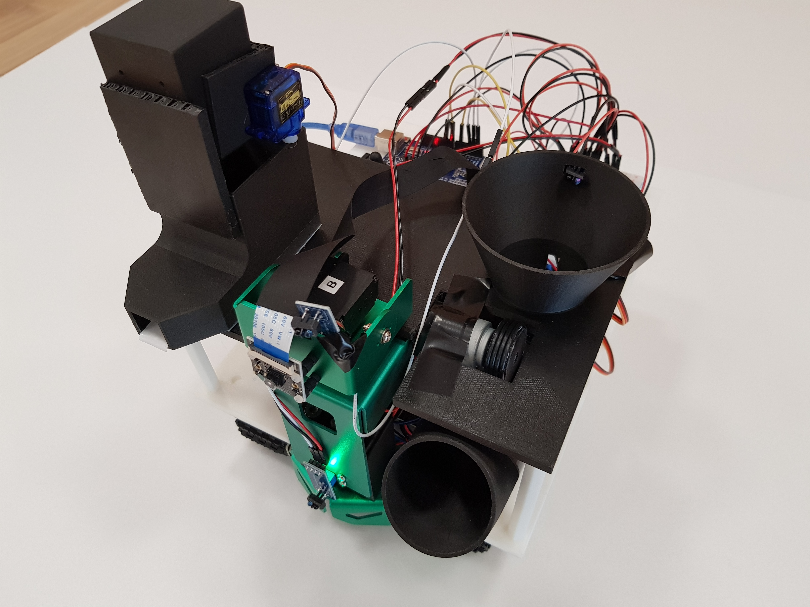
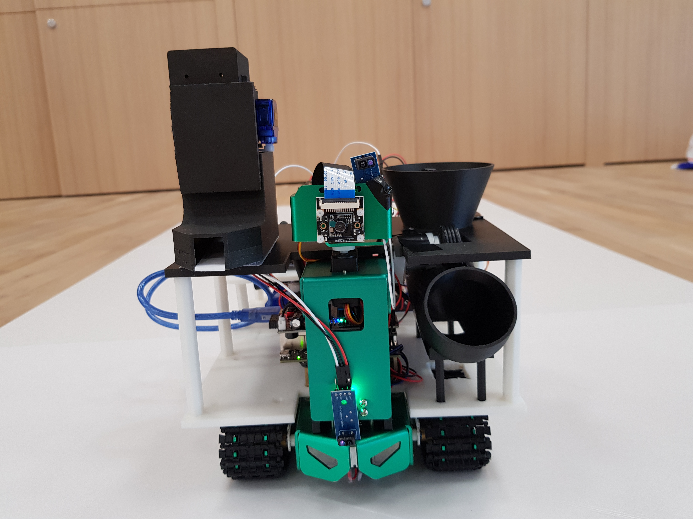
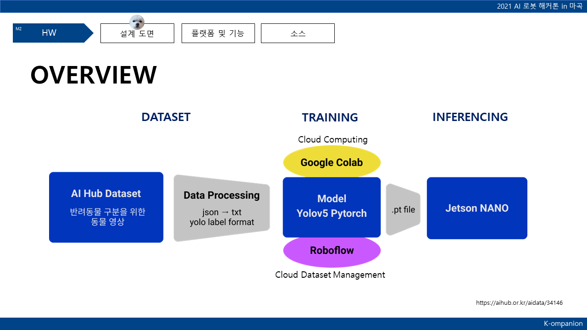
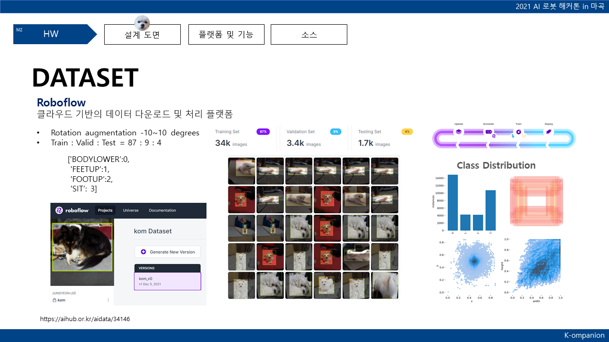
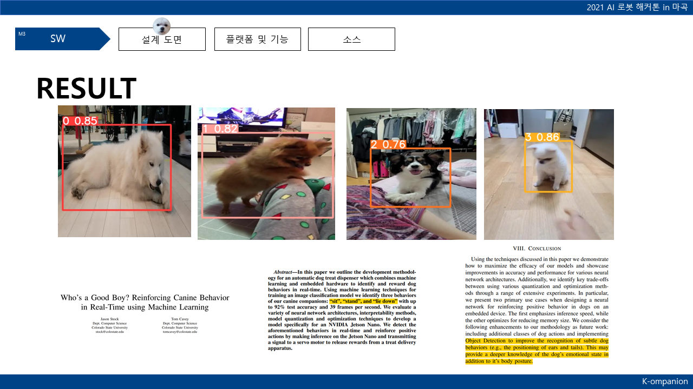

Team members: 신홍철, 양희태, 황수인

## [TRAINING Notebook](https://colab.research.google.com/drive/1ylJkBkTyJKYme370JfXaRW_AW5xW82rz?usp=sharing) - Google Colab

## [Training Log and Result](@wandb log) - WandB

|||
|-|-|
|||
|||

## Goal : Dog Action dataset + Yolov5 + Jetson Nano

### Dataset

https://aihub.or.kr/aidata/34146

### Jetbot

http://www.yahboom.net/study/JETBOT

### Yolo

- [Yolov5](https://github.com/ultralytics/yolov5)
- [JetsonYolo](https://github.com/amirhosseinh77/JetsonYolo/blob/main/JetsonYolo.py)
- [yolov5-tensorrt](https://github.com/SeanAvery/yolov5-tensorrt)

### Other models we tried

#### Retina Net

`python keras_retinanet/bin/train.py --gpu=0 --epochs=10 --steps=1000 --workers=0 csv .\csv\action.csv .\csv\action_mapping.csv`

[keras-retinanet
](https://github.com/fizyr/keras-retinanet)

[Object Detection with RetinaNet - keras docs](https://keras.io/examples/vision/retinanet/)

[Custom Dataset으로 Retinanet 학습하기](https://boysboy3.tistory.com/149)

[Keras Model을 TensorRT로 변환하기](https://hagler.tistory.com/188)

#### Efficient Net- Pytorch (Lightining)

[EfficientNet with Pytorch](https://ys-cs17.tistory.com/34)

[TensorRT_classifier_efficientNet](https://github.com/arvcode/TensorRT_classifier_efficientNet)

### Other source
[Jetson/리눅스에서 더 빠른 VNC 서버 사용하기](https://kamilake.com/306)

[DeepLabCut](https://github.com/DeepLabCut/DeepLabCut)- [Model Zoo](http://www.mackenziemathislab.org/dlc-modelzoo)

[DogFaceNet](https://github.com/GuillaumeMougeot/DogFaceNet)

[Hackathon edu](https://github.com/Jinhyeok1489/hakathon)
